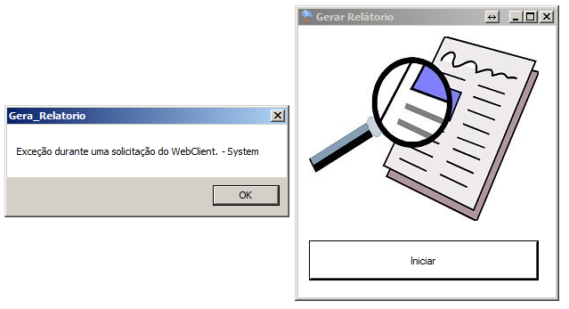

# BlueScreen

## Description
[PT-BR]
Esse software de gerar relatorio bacana quando funcionava.
Nao acho mais os arquivos! Agora nao sei se ele nao baixa.
Mestre resolva isso e como recompensa deixei a flag no relatorio. 

[EN]
This report generator software was good until stop works. I can't find my files. Now I don't know why the downloads doesn't works. 
Solve the challenge and as a reward there is a flag into the report. 

## Solution

The challenge redirected us to a website asking to install a component, required to load the application. Our goal was to find the report and get the flag.


As we can see, in this challenge we had some .NET application to play with! :D

After installing the component, we can see a simple app with just one button labeled "Iniciar", but when you clicked the button, an exception was showed to us on the screen.



With the application up and running, we can use some .NET decompiler to check inside the "source code" and see if we get something interesting. My favorite decompiler is DnSpy, you can check it in the end of the writeup.

Let's take a look.

In this simple procedure, we found some this piece of code:


```bash
webClient.DownloadFile("http://162.243.187.35:8080/relatorio.png", "!c:/relatorio.xlsx");
webClient.DownloadFile("http://162.243.187.35:8080/relatorio.xlsx", "!c:/relatorio.png");
```

The PNG image is just a distraction *(we saw a lot of fake flags on this CTF, and it was fun!)*.

The xlsx file had three worksheets, and in the third one, there was the flag!

Flag: 3DS{Windows_0/Windows_DotNet}
