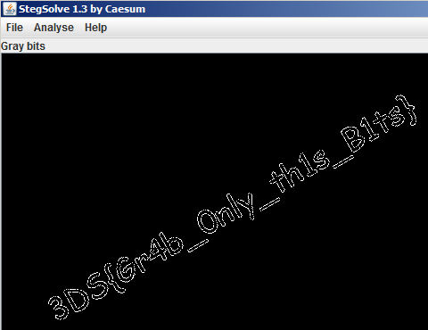

# Excaliflag

## Description
[EN] 
Only a true hacker could pulling the flag from this ground. 

[PT] 
Somente um verdadeiro hacker poderia puxar a bandeira deste chao.

## Solution

The image contains a real flag stuck into the ground and nothing more.
Using the gray bits filter from [Stegsolve](https://github.com/zardus/ctf-tools/blob/master/stegsolve/install), the flag was revealed.

Flag: 3DS{Gr4b_0nly_th1s_B1ts}