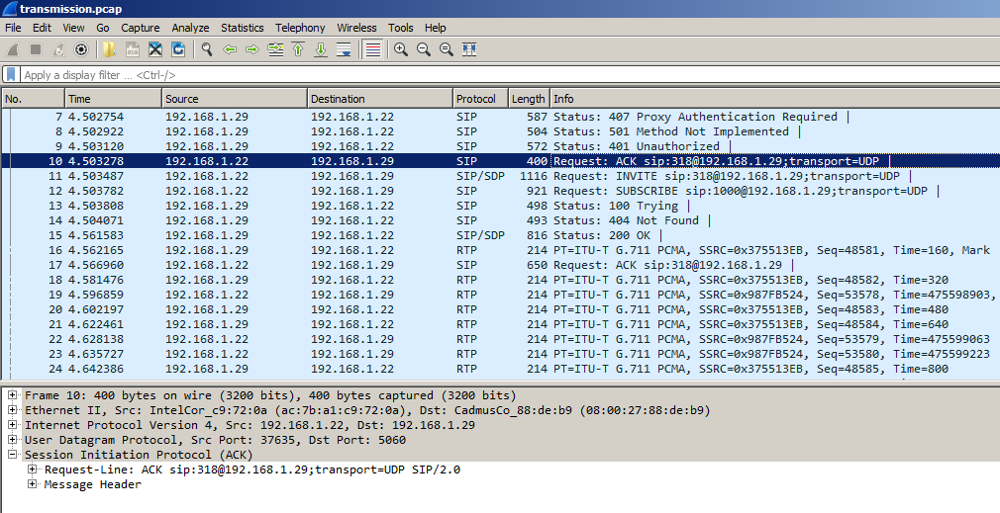
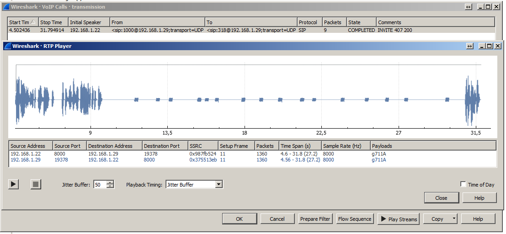

# HALP

## Description
[EN]
We need your hackers skills to retrieve a code that was send in the attached file. Please, help us!
Flag format: 3DS{}

[PT-BR]
Nós precisamos das suas habilidades para resgatar o código transmitido no arquivo em anexo. Por favor nos ajude.
Flag no formato: 3DS{}

## Solution

The file given by the challenge is a network capture. By analyzing its structure, we can see the SIP / SPD / RTP protocols that are used in VoIP calls.

Assuming capture is a VoIP call, let's check if we can get something interesting inside it.
Using Wireshark, following the Telephony menu - VoIP calls, we can see a call and listen to the content.

The voice from the call asks for a card number and after that we can hear a series of signals. The signals are DTMF tones *(Dual-Tone Multi-Frequency)* used in modern telefones.
With that information, all we have to do is "decode" the DTMF song.

I used [this website](http://dialabc.com/sound/detect/index.html) to do the hard work! :D
 

Flag: 3DS{4952061545946271}