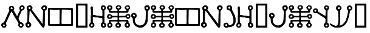
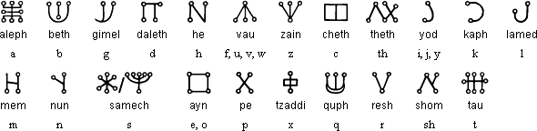

### cripto30

A imagem apresentada no desafio apresenta o nome "malachim.png". Em uma rápida pesquisa, é um alfabeto antigo derivado dos alfabetos grego e hebráico.

Então, basicamente o desafio se resumia em encontrar o significado de cada letra desse alfabeto desconhecido. 
Uma simples tabela de substituição foi suficiente:

Alguns caracteres não reconhecidos foram alterados para o padrão das flags do CTF, por exemplo, "{}_".

Flag: SHC{malachim_lang}