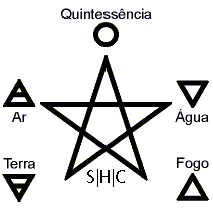

### for30

O desafio apresentava um arquivo compactado com uma imagem e um arquivo de log do apache.



Depois de algum tempo perdido tentando achar escondido dentro da imagem e tentando fazer algum filtro no arquiv de log com o cabeçalho padrão das flags, olhei novamente o enunciado:


> Os diversos símbolos na Wicca são a linguagem criadora que expressam o que "não pode ser dito claramente".


Quando olhei novamente na imagem, tudo fez sentido! 

````shell
[root@localhost for30]# grep "S|H|C" error.log
http://S|H|C{Log_Forense_Expertise}}/eventos.php
```

Flag: SHC{Log_Forense_Expertise}