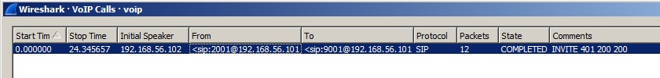
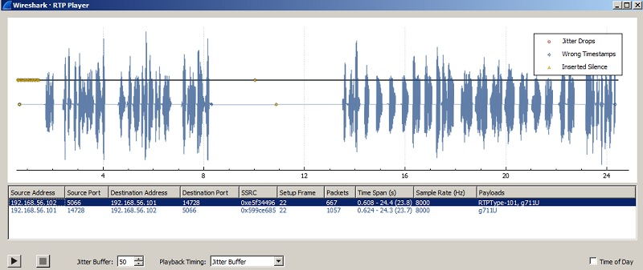

### VoIP

O desafio fazia parte da categoria Forensics e valia 100 pontos. :)

O arquivo baixado era a captura de rede de uma ligação VoIP. Como nunca havia realizado uma análise desse tipo, recorri ao wiki do Wireshark[1].

Seguindo o menu "Telephony - VoIP Calls", é possivel visualizar quais as ligações no arquivo de captura e escutá-las. Esse recurso está implementado para alguns codecs VoIP.

A ligação, apesar de ser uma voz robótica e de difícil interpretação, apresentava a flag: SECCON{9001IVR}

Links:

[[1] - Wireshark](https://wiki.wireshark.org/VoIP_calls)