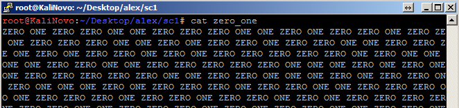

# CR1: Ultracoded

## Description

Fady didn't understand well the difference between encryption and encoding, so instead of encrypting some secret message to pass to his friend, he encoded it!
Hint: Fady's encoding doens't handly any special character

## Solution

The challenge give us a file full of the words ZERO and ONE. 

Our first instinct was to replace the words for the numbers 0 and 1, respectively. After  that, at the first sight, we spotted a base64 string.

Decoding the base64, it showed a nice morse code string, using [this](http://www.unit-conversion.info/texttools/morse-code/) website, we got the following text: alexctfth15o1so5up3ro5ecr3totxt

After put the flag in the correct format: ALEXCTF{TH15_1S_5UP3R_5ECR3T_TXT}