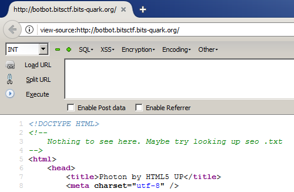
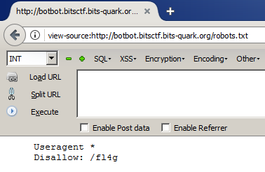

# BotBot

## Description

Should not ask for the description of a 5 marker.
botbot.bitsctf.bits-quark.org

## Solution

Accessing the given website, there wasn't anything interesting at source code besides an information about the SEO (Search Engine Optimization).
SEO is a group of techniques to optimize the search results related about your website.

One of these techniques is the robots.txt configuration. So, following this path, we found something:

In this directory, we got the flag: BITCTF{take_a_look_at_googles_robots_txt}