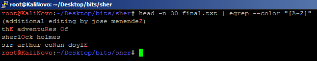

# Sherlock

## Description

Sherlock has a mystery in front of him. Help him to find the flag.

## Solution

The given file is a plain text file, without any special information. It's just a text from the adventures of the great Sherlock Holmes.
We found something interesting while we're working on this challenge, there was some capital letters.
Our team mate @cyborg found this and we started to work on it.



These group of capital letters are clearly the words 'ZERO' and 'ONE'.
From this approach, we assumed we had to convert this binary information to something readable.

With a simple python script, we got the flag:

```python
import re
import binascii

word = open('final.txt').read()
r = re.findall('([A-Z])', word)
print binascii.unhexlify('%x' % (int(''.join(r).replace('ZERO','0').replace('ONE','1'),2)))
```

Which gave us the flag: BITSCTF{h1d3_1n_pl41n_5173}