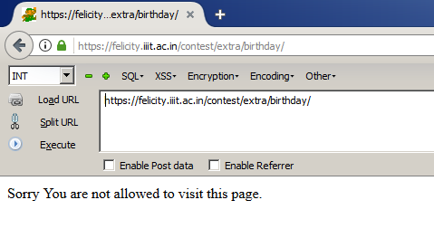
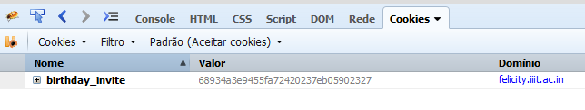
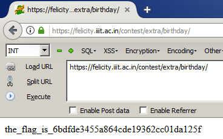

# A present for her Birthday!

## Description

Yesterday was Animesh's best friend's (at least he thinks so) birthday. Animesh had bought a nice present for her, but she didn't even invite Animesh :-( . He came to know that only the people who have the secret key for the birthday party can get the invitation the party. Unfortunately Animesh does not have that key, but he know that the key can be found [here](https://felicity.iiit.ac.in/contest/extra/birthday). Can you help Animesh find the key so that he can attend her birthday party and give her the sweetest present he bought for her.

## Solution

The link redirect us to a simple website with no links, inputs or anything else. There was just a message:

With no information in the source code, I started looking at the cookies, where I found something interesting:

The cookie birthday_invite has the value *68934a3e9455fa72420237eb05902327* which is the md5 hash for "false".

Following a simple logic, I changed its value for *b326b5062b2f0e69046810717534cb09* which is the md5 hash for "true" and here's the result:

Flag: the_flag_is_6bdfde3455a864cde19362cc01da125f