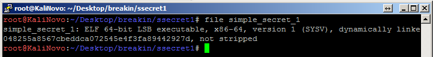
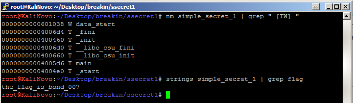

# Simple Secret - Part 1

## Description

Mandy and Aalekh are good friends. Once Mandy thought of giving Aalekh a challenge where Aalekh has to extract the secret key used by Mandy in his C program. The executable generated by Mandy is given below. Can you help Aalekh in finding the secret key hidden by Mandy?

## Solution

The given file is a ELF format binary.

In this challenge we didn't have any interesting information on the symbol tables, so we just tried a simple approach:

Which gave us the flag: the_flag_is_bond_007