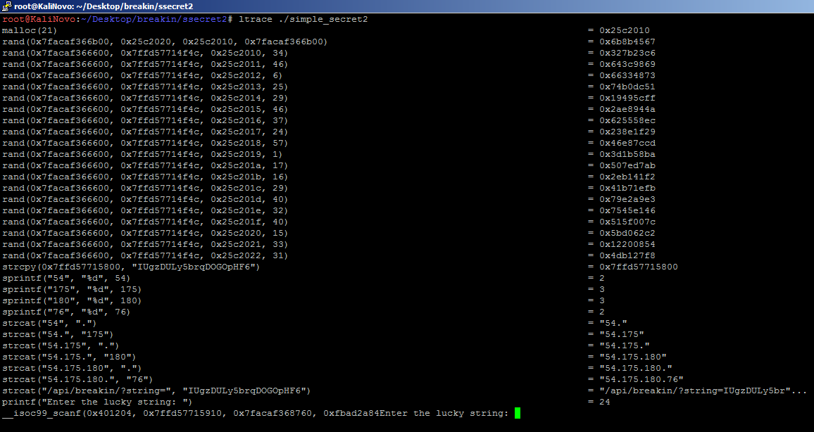

# Simple Secret - Part 2

## Description

As Aalekh successfully cracked the secret given by Mandy in Simple Secret- Part 1 Mandy comes with a stronger way of hiding the secret. Can you help Aalekh this time?  

## Solution

The given file is a ELF format binary.

Since the file it's *stripped*, we don't have to much information about its symbols and debugging information. So, let's run the binary and see what functionalities it has.

The flow looks simple, the binary has a challenge asking us a *lucky string* and when we give the wrong information, it just return a message and finishes the program.
Before starting to analyse the internal structure, I wanted to see the calls for the linked libraries and I saw a good point to start digging at :)

The strcat function appends some text to a given string, and at the end of its procedure, we have something like an IP Address with some path: 

54.175.180.76/api/breakin/?string=IUgzDULy5brqDOGOpHF6

When we access the url, we got the flag: the_flag_is_c47aced5c6004d6c868fffd74dc6f61b