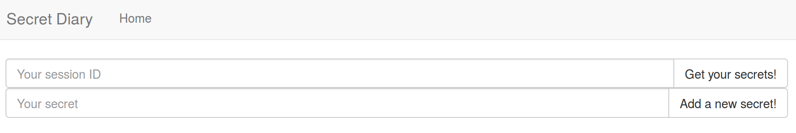

     My friend created a website where we can store secrets... Unfortunately, we can only see our own. Help me find all of my friend's secrets. 

Really simple stuff. Just a place to insert a 'secret' and another to retrieve it.

Just a mainstream

    ' or 1=1 --

instead of the session ID should do it.

## Why it works

The nice thing about these challs is they all give you the source codes. This could spoil a real CTF chall but it is great for learning purposes.

The vulnerability we exploited is in this snippet below.

~~~~

if (isset($\_POST['session_id'])) { 
    $query = "SELECT * FROM secrets WHERE session_id = '" . $_POST['session_id'] . "'";
    $result = $conn->query($query);
}
~~~~

Yep, no input sanitization. Our 'session_id' field is directly inserted into the query, allowing us to pass some malicious code. In this case we build a new query to bypass the login:

    "SELECT * FROM secrets WHERE session_id = '" ."' or 1=1 -- " . "'";

Note that we needed to append "*-- *" to our parameter. The *--* is necessary to comment the rest of the query, so it makes sense. Nevertheless, we also needed to append a blank space to it so MySQL understands the query.
