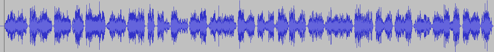
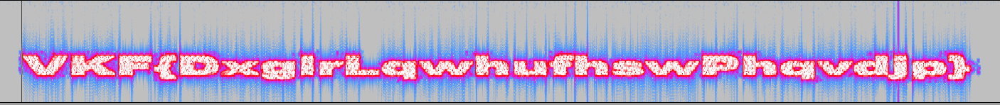

### critpo30

O arquivo baixado é um áudio .wav do presidente dos EUA Barack Obama anunciando a morte de Osama Bin Laden. Aparentemente não há nada de errado com o arquivo, mas com um pouco de paciência chegamos aos últimos segundos do áudio, em que se ouve um ruído, como se a flag falasse conosco :)

Abrindo com o Audacity, podemos ver claramente o ruído a partir do tempo 1:15, mas não parece dizer muito. 

Como o chall falava de duas técnicas, incluindo uma de cripto, pensei que o ruído poderia ser um código morse, binário, ou qualquer coisa do tipo. Como não achei nada disso, parti para outras análises da onda.

O Audacity permite que visualizemos o áudio pelo espectrograma, ao invés do formato da onda. Para isso basta selecionar a opção na seta à esquerda da onda (audio).

Agora sim! Claramente nossa flag criptografada. Pelo formato é bem provável que seja uma cifra de substituição bem simples, como césar. Testando online (aqui)[http://www.xarg.org/tools/caesar-cipher/) vemos que realmente é de fato um ROT23.

O único problema é que essa flag não é aceita! Talvez o challenger quisesse colocar um pouco de guessing ou foi um erro de digitação mesmo. Adicionando o *e* que falta fechamos a questão :)

    flag: SHC{AudioInterceptMensagem}
