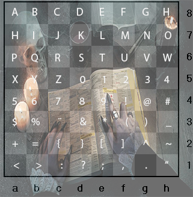

### cripto20

O desafio apresentava era um arquivo compactado com uma imagem e um arquivo texto.
A imagem é um tabuleiro *bizarro* com uma sequencia de números {1~8} e letras {a-h}.

O arquivo texto continha uma série de "comandos" que deveriam ser executados, fazendo uma alusão ao jogo de xadrez!

> Move Cavalo de E4 para D6

> Move Torre de H4 para H8

Percebi que a junção das letras e números no movimento de destino nas primeiras sentenças montavam o cabeçalho padrão de flags do CTF. Dando continuidade ao processo, a flag era apresentada:

> Move Cavalo de E4 para D6 - S

> Move Torre de H4 para H8 - H

> Move Rei de D8 para C8 - C

> Move Rei de D1 para C2 - {

> Move Torre de A2 para A6 - P

> Move Torre de H8 para H7 - O

> Move Cavalo de B8 para C6 - R

> Move Peão de E7 para E6 - T

> Move Torre de A6 para A8 - A

> Move Bispo de F8 para E7 - L

> Move Bispo de F1 para H3 - _

> Move Rei de C8 para D8 - D

> Olhei para Torre em H7 - O

> Olhei para Bispo em H3 - _

> Move Cavalo D6 para F7 - M

> Move Rei de D8 para E8 - E

> Move Rei de E8 para D8 - D

> Olhei para Torre em H7 - O

> Move Cavalo B1 para D2 - }

Flag: SHC{PORTAL_DO_MEDO}