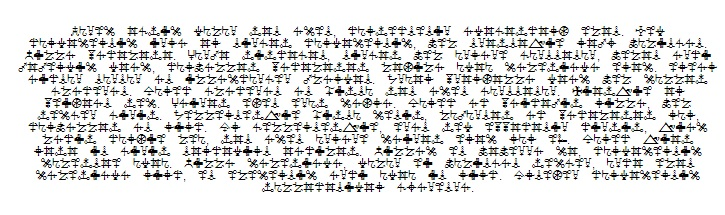

### web10

O desafio apresentava uma página web com alguns caracteres *bizarros*.



Com certeza a flag estava por ali, então o modo mais simples é sair filtrando tudo :)

```shell
[rafael@localhost web10]# wget  -r https://ctf.sucurihc.org/flag/oldreligion/web10/index.html
[rafael@localhost web10]$ grep "SHC{" -r ctf.sucurihc.org/
ctf.sucurihc.org/flag/oldreligion/web10/b.html:<p>SHC{Web_old_religion_true}</p>
ctf.sucurihc.org/flag/oldreligion/web10/a.html:<p>SHC{Web_False_religion}</p>

```
Com uma pequena distração, a flag é apresentada!

Flag: SHC{Web_old_religion_true}