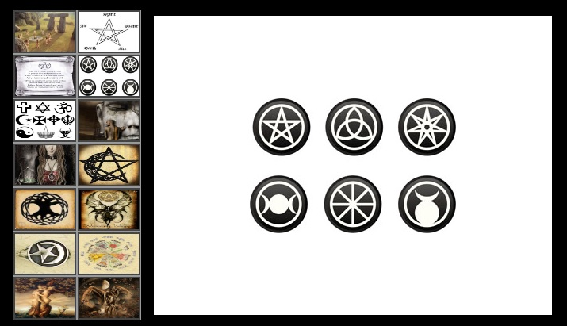

### web20

O desafio apresentava uma página web com uma série de imagens.



Logo de cara no source da página, a propriedade "alt" das imagens possuía algo interessante! Para treinar um pouco de python, fiz um script para fazer o trabalho sujo.

```shell
[rafael@localhost web20]$ python3 solve.py
[DEBUG] >> Opening url https://ctf.sucurihc.org/flag/oldreligion/web20/index.html
Flag: SHC{Wiccanos!}
```
Flag: SHC{Wiccanos!}